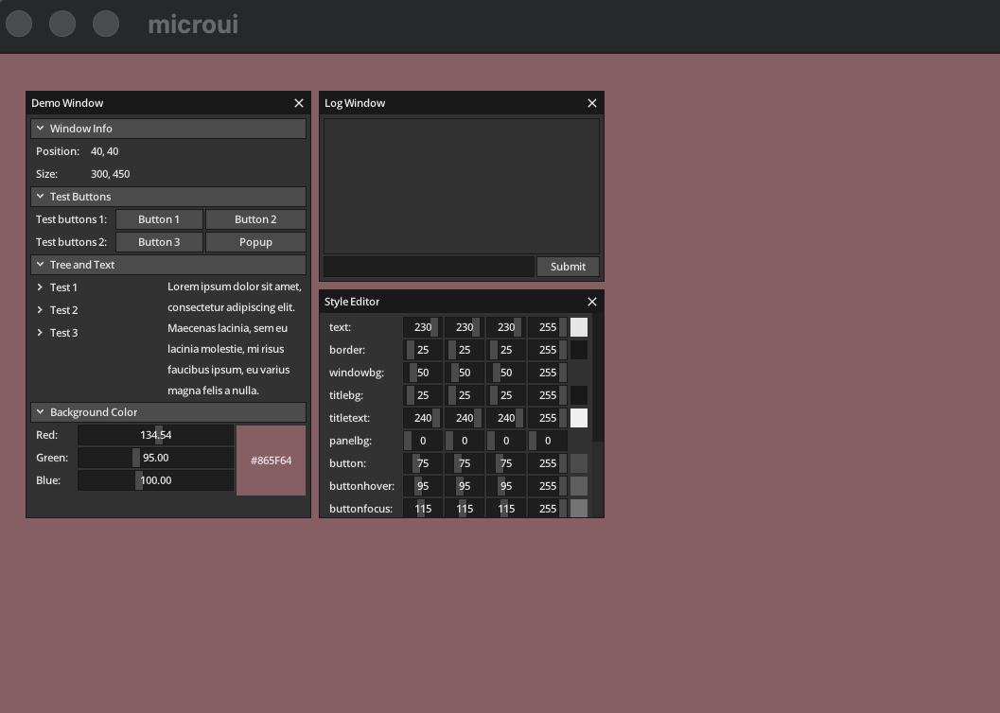

# gomicroui：一个由 AI 完成的 Microui Go 语言移植
[English](README.md) | 简体中文
> **项目状态：** ✅ 实验成功 | **人类代码贡献：** 0 行

## 项目简介

**gomicroui** 是一个试验性的 GUI 项目，它是著名的单头文件 C 语言库 https://github.com/rxi/microui 的 Golang 移植版本。

Microui 以其极简著称（仅一千多行代码），且不绑定任何渲染后端。理论上，只要实现了矩形绘制和文本渲染，就能实现一个完整的 GUI 系统。本项目验证了：**仅凭 AI Agent，能否完成这种复杂的底层移植工作。**

## 开发模式：我是架构师，AI 是工程师

在这个项目中，**我没有写一行代码**。我的角色是一位系统架构师，负责评估可行性、制定策略、指出 Bug 并做出最终决策。

我雇佣了两位 AI Agent 作为“工程师”：

| Agent | 性格特征 | 工作方式 |
| :--- | :--- | :--- |
| **CodeBuddy** | 固执己见，按套路走 | 虽然接受了建议，但总想坚持自己的实现路径（我怀疑它在故意消耗上下文长度，虽然没证据 😂）。 |
| **Trae** | 雷厉风行，见风使舵 | 听取建议后果断放弃 SDL2 迁移方案，直接使用 Go 的 GPU 库重写 Demo，执行力极强。 |

## 开发历程：一场 AI 协作的戏剧

1.  **评估与决策**：分析 microui 源码，确认其无外部依赖，判断 AI 有能力完成移植。
2.  **第一轮尝试 (CodeBuddy)**：
    *   成功将核心库转为 Go。
    *   在编写 Demo 时陷入困境，试图处理并不存在的 SDL2 Go 绑定，导致失败。
    *   额度耗尽，罢工。
3.  **第二轮抢救 (Trae)**：
    *   接受明确指令：放弃 SDL，使用 Go GPU 库。
    *   经过漫长的排队和几次试错（解决了指针异常、画面闪烁、点击判定等问题），最终成功运行。
    *   树形组件展开、按钮交互一切正常。

## 结论：这不是“氛围编程”

很多人称 AI 编程为“Vibe Coding”（氛围编程），但在我看来，**这只是另一种形式的工程管理**。

无论是 AI 还是人类，工程师都有不同的性格：有的需要手把手教，有的会自作主张。作为管理者，核心能力依然是**识别问题、给出正确指令以及验收结果**。在这个项目里，我只是换了一批不需要睡觉、不会抱怨的“员工”而已。

## 运行截图

## 致谢

*   **rxi** 创造了神奇的 https://github.com/rxi/microui。
*   **CodeBuddy** 和 **Trae**，感谢你们写的几千行代码（虽然其中一个差点把项目搞砸）。

---

*“听人劝，吃饱饭。” —— 项目负责人（没写代码的那位）*
*“codebuddy 是GLM5.2和GLM5.1，trae使用的是Auto模式，其默认是doubao”
